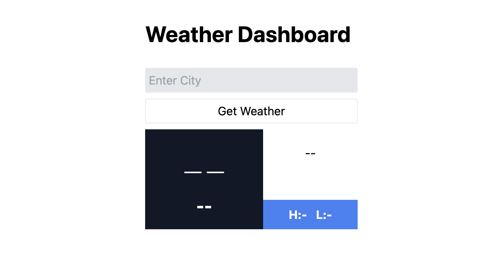

# Weather Dashboard 🌦️🌡️

## Overview

Weather Dashboard is a simple yet powerful application built using [SvelteKit](https://kit.svelte.dev/). Enter a city to get real-time weather updates including temperature, weather conditions (Sunny, Rainy, etc.), and daily high & low temperatures.



---

## Table of Contents

1. [Installation](#installation)
2. [Usage](#usage)
3. [Features](#features)
4. [API Used](#api-used)

---

## Installation

To get started with Weather Dashboard, follow these steps:

1. **Clone the repository:**

    ```bash
    git clone https://github.com/AlefAlfa/WeatherDashboard.git
    ```

2. **Navigate into the project directory:**

    ```bash
    cd WeatherDashboard
    ```

3. **Install dependencies:**

    ```bash
    npm install
    ```

4. **Run the development server:**

    ```bash
    npm run dev
    ```

Visit `http://localhost:5173` to see the application in action!

---

## Usage

- Type the name of the city into the search bar.
- Press enter or click the search button.
- The dashboard will display the current weather conditions for the entered city.

---

## Features

- **Weather Icons**: Visualize the current weather conditions (Sunny, Rainy, etc.) through descriptive icons.
- **Temperature Details**: Know the current temperature, as well as daily high & low temperatures.

---

## API Used

Weather data is fetched using the [OpenWeather API](https://openweathermap.org/api).

---

Made with ❤️ by [Your Name](https://yourwebsite.com)
